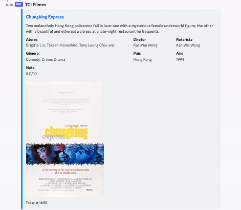

# TCI Filmes

A Discord bot that helps me manage my server's movie watchlist. The bot is simple yet efficient, allowing me to easily add and remove movies from the watchlist, and providing useful information about each title such as its release year, genre, and synopsis. With this bot, my server members and I can keep track of the movies we want to watch and ensure that we never miss a great film again.

### Installation

1. Clone the repository to your local machine:
```bash
git clone https://github.com/Daniel-EST/discord-movies-bot
```

2. Navigate to the project directory
```bash
cd discord-movies-bot
```

3. Install npm required packages
```bash
npm install
```

#### Setting up the environment variable file

To set up the environment variable file, you can create a file called **`.env`** in the root of the repository. You can use the **`.env.example`** file as a template for the **`.env`** file.

- **`DISCORD_TOKEN`**: This is the key of your Discord app.
- **`DISCORD_GUILD_ID`**: This is the ID of your server.
- **`OMDB_TOKEN`**: This is your personal API key for Open Movie Database.

The **`.env.example`** file contains the following variables:
```
DISCORD_TOKEN=<your_discord_app_key>
DISCORD_GUILD_ID=<your_guild_id>
OMDB_TOKEN=<your_omdb_key>
```


### Running:
```bash
npm run serve
```


### Available Commands:

- `/listar_filmes`: List of all movies added by users;
- `/adicionar_filme`: Add movie to list;
- `/remove_filme`: Remove movie from list;
- `/informacoes_filme`: Retrieve movie infromation from web;
- `/sortear_filme`: Selects a random movie;

### Example

Retrieving information of a movie:  



## TODO
- Error handling;
- Interactions using reactions or buttons;
- Improve SQLite implementation'
- Docker for easily deployment on my Raspberry Pi.
